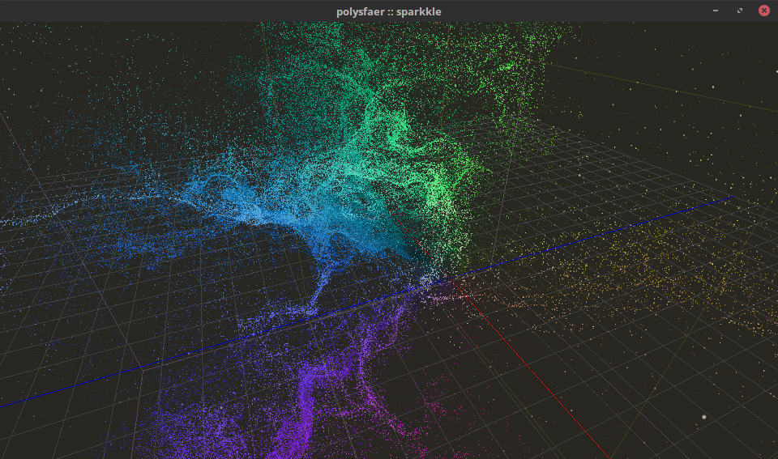

# Spärkle




Spärkle is a particle engine running entirely on the GPU, inspired by the work of SquareEnix Advance Technology Division on *Agni's Philosophy*.

It is written in **C++ 11** and **OpenGL 4.x**.

## Feature

- Complete Compute Shader based GPU pipeline,
- Bitonic Sorting for alpha-blending,
- Curl Noise,
- 3D Vector Field,
- *Structure of Arrays* and *Array of Structures* data layout patterns,

Work in progess :

- *Repulsion forces*,
- *Mesh Targetting* 

## Quickstart

### Dependencies

- [GLFW 3.x](https://github.com/glfw/glfw/tree/3.0),
- [GLM 9.8](https://github.com/g-truc/glm/releases/tag/0.9.8.0).
- OpenGL extensions are generated automatically by a custom [Python](https://www.python.org/downloads/) script, but optionnally [GLEW](http://glew.sourceforge.net/) can also be used.

### Build

Using a command-line on Unix or [Git Bash](https://git-for-windows.github.io/) on Windows, first create a build directory:
```
$ mkdir build
$ cd build
```

Then generate the Cmake Cache depending on your system:

#### Unix

Using Makefile:

```
$ cmake .. -G Makefile -DCMAKE_BUILD_TYPE=Release
```

To build type:
```
$ make -j
```

#### Windows

Using MSVC 15 for x64:
```
$ cmake .. -G "Visual Studio 15 2017 Win64"
```

To build type:
```
$ cmake --build . --target all --config Release
```

*Note: using CMake, the build configuration type (ie. Debug, Release) is set at Build Time with MSVC and at Cache Generation Time with Makefile.*

### Run

To run, go to the bin directory:
```
$ cd ../bin
$ ./sparkle_demo
```

[//]: # (## Directory structure)


[//]: # (## Known bugs)

---

## References

- *Practical Applications of Compute for Simulation in Agni's Philosophy*, Napaporn Metaaphanon, [GPU Compute for Graphics, ACM SIGGRAPH ASIA 2014 Courses](http://www.jp.square-enix.com/tech/library/pdf/SiggraphAsia2014_simulation.pdf),
- *Curl noise for procedural fluid flow*, R. Bridson, J. Hourihan, and M. Nordenstam, [Proc. ACM SIGGRAPH 2007](https://www.cs.ubc.ca/~rbridson/docs/bridson-siggraph2007-curlnoise.pdf),
- *Noise-Based Particles*, Philip Rideout, [The Little Grasshoper](http://prideout.net/blog/?p=63),
- *Implementing Improved Perlin Noise*, Simon Green, [GPU Gems 2](https://developer.nvidia.com/gpugems/GPUGems2/gpugems2_chapter26.html)

## License

*Spärkle* is released under the *MIT* license.